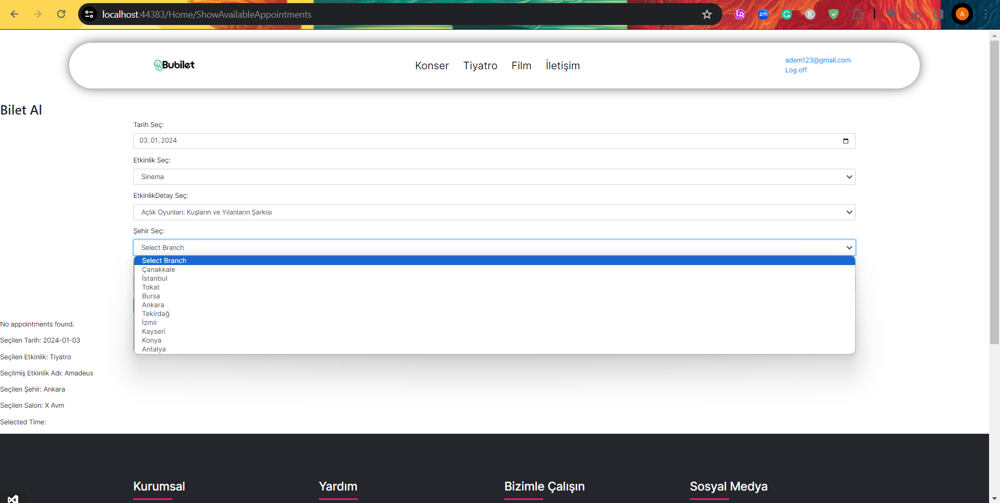

# Theatre-Cinema-Concert-Tickets-Reservation-Website
online platform for reserving theatre, cinema, and concert tickets. On this website, you can easily purchase tickets by first selecting event details, choosing your preferred seats, and completing the payment process.

# WHAT IS POSSIBLE WITH THIS APP
From starting main page , Navbar contains  theatre,cinema,concert links this links leads user to specific page for specific event.
by clicking contact link user will be directed to contact page and at the far user can click register to register , login to login afterwards can click on 
their username to go to profile page , and logout to logout.
Main page helps user to see event images for theatre,cinema,concert events. If any of the images will be clicked user will be directed to 
specific pages for specific events. 
At the bottom of the page footer will lead user to contact page.

By clicking contact , How to buy a ticket etc. user will go to contact page , contact page contains different information
that can be reached by clicking specific topic from sidebar. 

after clicking "login" user will be leaded to login page where every value checked from database to login. 
If user dosent have any account "register" could be clicked. 

after login user can click on username to see the user information and from side bar user can go to my tickets topic to display every topics that bought 
by that username.

from specific event pages such as concert, theatre , cinema pages user can select any specific event like napoleon and see the ticket details
from there user can click buy a ticket button. 

Buy a ticket page requires from user to select a date , event type , event name , city , salon. After selections avaliable hours will appear 
and user will select the hour of event and proceed to seat selection page.

Seat selection page controls dynamically if seats occupied or not from database user can select many seats , price will be updated by that and can proceede 
to payment page

Payment page requires card information from user and uses lungth algorithm to check if card is real or not. After confirm payment button clicked user can see
ticket from profile page.

Only admin can see the Admin page and from there admin can see all users , can edit-delete-add new ticket's for any event type.

 # HOW TO RUN THE APP

 firstly, open project using an IDE, Visual Studio 2022 Preferable. 
 then set up the .bak file to mssql server. 
 after that change the web-config file where  <add name="biletDataConnection" connectionString="Server=YOURSERVERNAME;Database=icerik;User ID=YOURUSERNAME;Password=YOURPASSWORD;Integrated Security=False;MultipleActiveResultSets=True;" providerName="System.Data.SqlClient" />
should be like that ,change YOURSERVERNAME with your actual mssql server name , YOURUSERNAME with your mssql actual user name , YOURPASSWORD with your actual mssql password

 
